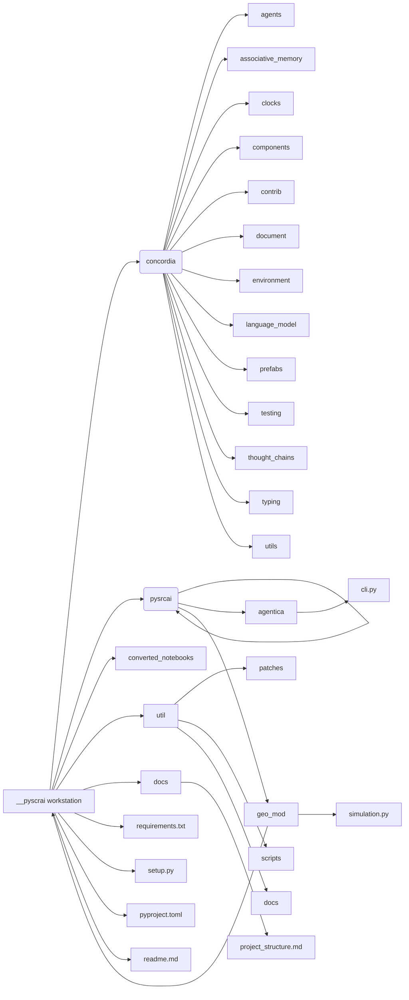

# __pyscrai Workstation Project Structure

```mermaid
flowchart LR
    A[__pyscrai workstation] --> B(concordia)
    A --> C(pysrcai)-->
    C --> C1[agentica]
    C --> C2[geo_mod]-->
    A --> D[converted_notebooks]
    A --> E[util]
    A --> F[docs]
    A --> G[requirements.txt]
    A --> H[setup.py]
    A --> I[pyproject.toml]
    A --> J[readme.md]

    %% Concordia subfolders
    B --> B1[agents]
    B --> B2[associative_memory]
    B --> B3[clocks]
    B --> B4[components]
    B --> B5[contrib]
    B --> B6[document]
    B --> B7[environment]
    B --> B8[language_model]
    B --> B9[prefabs]
    B --> B10[testing]
    B --> B11[thought_chains]
    B --> B12[typing]
    B --> B13[utils]

    %% pysrcai submodules
    C1 --> C1a[cli.py]
    C2 --> C2a[simulation.py]

    %% util subfolders
    E --> E1[patches]
    E --> E2[scripts]
    E --> E3[docs]

    %% docs subfolders
    F --> F1[project_structure.md]
```
